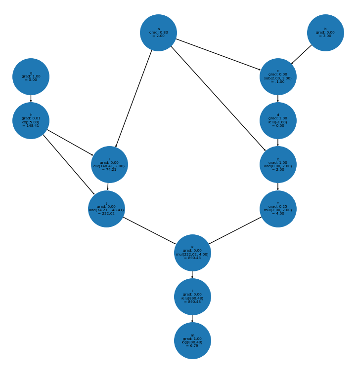

# simplegrad

Like pytorch autograd, but simple. Implements the class 'Num' as a wrapper for floats that keeps track of which operations were used to create it. This can then be used to calculate gradients using reverse-mode autodiff.

### Example

	a = Num(2)
	b = Num(3)
	c = a - b
	d = relu(c)
	e = d + a
	f = e * e
	g = Num(5)
	h = exp(g)
	i = h / a
	j = i + h
	k = j * f
	l = relu(k)
	m = log(l)

